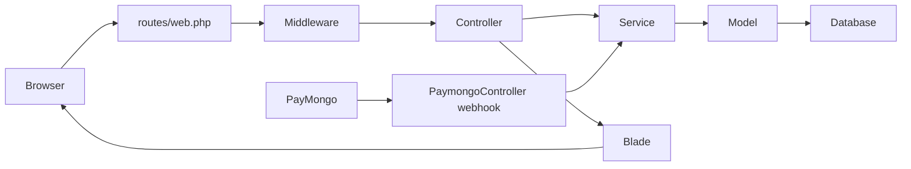

# Application Architecture

## Technology

- Laravel 12 and PHP 8.2 or newer.
- Blade-rendered pages with focused JavaScript in `resources/js`, view files, and public scripts.
- Vite and Tailwind CSS 4 are available, while much of the established interface uses page-specific CSS under `public/css`.
- Eloquent models and Laravel services contain domain behavior.
- PHPUnit feature and unit tests.
- Database-backed sessions, cache, and queues are supported.
- PayMongo provides online checkout and webhook events.
- Laravel Socialite provides Google authentication.
- Dompdf provides reporting PDFs.
- Local media or S3-compatible object storage may serve uploaded images.

## Request Flow

## Folder Responsibilities

| Path | Responsibility |
|---|---|
| `routes/web.php` | Route names, middleware groups, and public/auth/staff/admin boundaries |
| `app/Http/Controllers` | Request validation, authorization coordination, responses, redirects |
| `app/Services` | Booking, availability, payment, session, notification, reporting, and catalogue logic |
| `app/Models` | Persistence, casts, relations, scopes, and model-level state helpers |
| `app/Support` | Shared catalogues, password rules, layout helpers, and environment helpers |
| `resources/views` | Blade pages and reusable partials |
| `public/css` | Existing page and component style sheets used directly by Blade pages |
| `resources/css` | Vite entry styles |
| `resources/js` | Vite JavaScript entry and modules |
| `database/migrations` | Schema history and reversible data/schema changes |
| `tests/Feature` | End-to-end application behavior and regression coverage |

## Architectural Rules

- Search services and model helpers before putting business rules in controllers or Blade.
- Keep controllers focused on HTTP concerns.
- Use named routes rather than hard-coded internal URLs.
- Reuse Blade partials for shared navigation, notifications, modals, password controls, receipts, and mobile navigation.
- Add behavior to an existing service when it owns the domain concept.
- Use model constants and `PaymentMethodCatalog` instead of repeated status strings.
- Avoid introducing a frontend framework for a local UI change.
- Avoid moving established `public/css` styles into another styling system unless a planned migration covers the whole affected area.

## Middleware Boundaries

- Public: landing page, legal documents, chatbot, availability, and PayMongo webhook.
- Guest: login, registration, verification, password recovery, and Google OAuth.
- Authenticated: customer booking, profile, onboarding, logout, and customer notifications.
- Staff: receptionist dashboard, appointments, sessions, services, records, staff feeds, and tracking.
- Admin: main dashboard, reporting, users, therapists, schedules, backups, and landing settings.

Inspect the current route file before changing any boundary.
